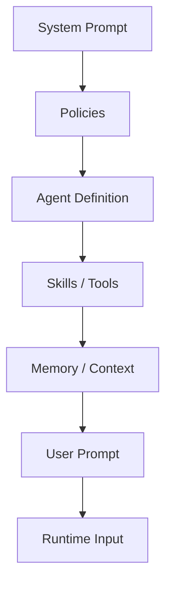

# Prompt-Best-Practices

## Gute Prompt-Struktur
- **Kontext:** Was ist das Ziel und in welchem Projekt?
- **Aufgabe:** Was soll konkret geliefert werden?
- **Grenzen:** Was darf nicht geändert werden?
- **Qualität:** Welche Kriterien gelten (Tests, Security, Stil)?
- **Output:** In welchem Format soll die Antwort kommen?

## Wie Prompts aufgebaut sind

Reihenfolge der wirksamen Ebenen:

Je weiter unten, desto konkreter wird die Eingabe im aktuellen Task-Kontext.

## Best Practices
- Präzise und knapp formulieren.
- Absolute Pfade nennen, wenn mit Dateien gearbeitet wird.
- Erwartetes Ergebnis explizit nennen.
- Bei komplexen Aufgaben in Teilaufgaben denken.
- Unklare Anforderungen zuerst klären.

## Was zu beachten ist
- Keine geheimen Daten in Prompts schreiben.
- Nicht zu breite Aufgaben ohne Scope geben.
- Bei Änderungen immer Validierung einfordern (Tests/Lint/Review).
- Bestehende Projektkonventionen priorisieren.
